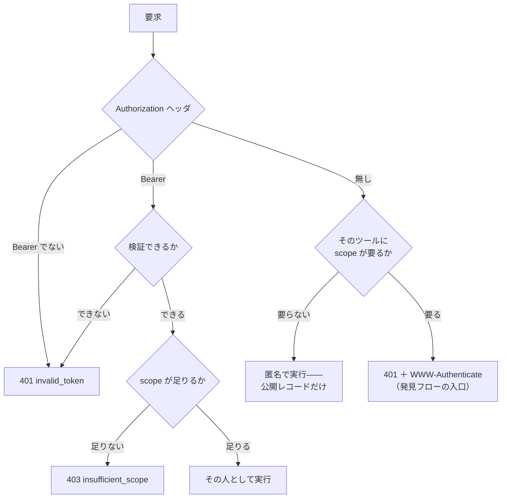
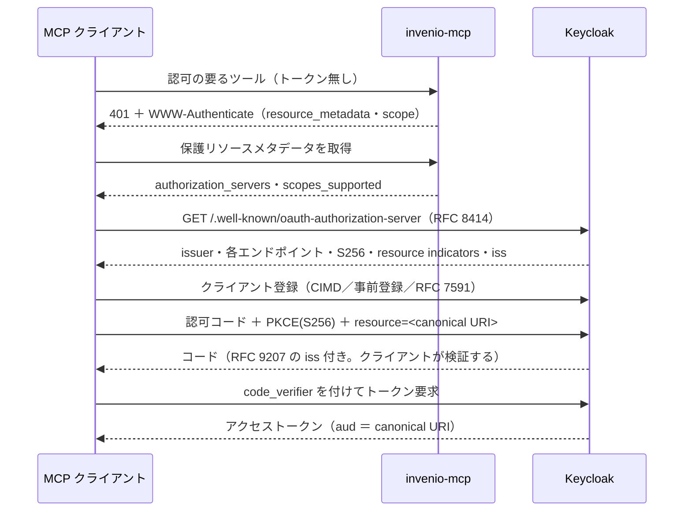

# 認証

このページが扱うのは**誰であるか**である。それが決まったあとの**何をしてよいか**は
[認可](authorization.md)の側にある。2つを分けてあるのは意図的で、実装でも分かれている
——検証器は資格情報を身元1つに変えるか、何も返さないかのどちらかで、scope の判定は
その身元が決まってから初めて走る。

分けてあるからこそ「匿名」が表現できる。ここでは**身元が無いこと**は失敗ではなく、
正当な結果である。リポジトリは誰にでも公開するものだからである。

## 身元の届き方は3通り

|  | stdio | HTTP・`invenio` モード | HTTP・`keycloak` モード |
| --- | --- | --- | --- |
| 資格情報 | InvenioRDM の個人アクセストークン1本 | 要求ごとに個人アクセストークン | 要求ごとに OAuth 2.1 のアクセストークン |
| 誰が検証するか | 誰も検証しない。そのまま使う | InvenioRDM（`GET /api/me`） | 本サーバ（realm の JWKS） |
| 区別できる身元 | 1つ | トークンごと | トークンごと |
| 匿名の呼び出し | 起こりえない。常にトークンを送る | ある | ある |
| 有効期限 | 無い | 無い | トークンの `exp`（既定 900 秒） |
| 失効のさせ方 | InvenioRDM でトークンを削除 | 同じ。キャッシュの TTL 内に効く | Keycloak のセッションを切るか `exp` を待つ |
| フェデレーション | 不可 | 不可 | 可（ブローカ経由） |

以下はこの順で見ていき、最後に3通りに共通することを書く。

## 資格情報の渡し方

`Authorization: Bearer <トークン>` を毎回付ける。受け付ける形はこれだけで、周辺の
規則はわざと厳しくしてある。

- **別のスキームは 401 で落とす。** `Authorization: Basic <トークン>` は匿名に落ちず、
  `error_description="Authorization scheme must be Bearer"` を付けた `401` になる。
- **クエリ文字列のトークンは見ない。** `?access_token=…` は一切参照しない。アクセス
  トークンを URI のクエリに置くことは仕様が禁じているので、その要求はただの匿名要求で
  あり、scope の要るツールなら `401` になる。
- **資格情報が有って無効なら、匿名には落とさない。** 期限切れ・偽造・別 issuer・
  別 audience、いずれも `401`。

最後の1つは立ち止まる価値がある。無効なトークンを黙って「トークン無し」として扱うと、
期限切れのセッションが機能を減らしたまま動き続ける——検索は公開レコードを返し続け、
本人の下書きだけが黙って消える。利用者にはそれが「ログアウトした」ではなく
**「レコードが消えた」**として見える。だから資格情報を出した瞬間から、それは正しく
なければならない。



「検証できるか」より右は[認可](authorization.md)の話で、左がこのページである。

## stdio: トークン1本・身元1つ

stdio 版は `INVENIO_TOKEN`、無ければ `server.py` と同じ場所の `.token` を読む。
`INVENIO_TOKEN` が優先される。取得元は他に無く、呼び出し側ごとの身元も無い——
そのプロセスに話しかけられる者が、**そのトークンの持ち主そのもの**である。

意外に思われがちな帰結が2つある。

- **起動時にトークンを確かめない。** `/api/me` を叩いて使えるか見に行くことはしない。
  誤ったトークンでも失効済みでもサーバは何事も無く起動し、最初のツール呼び出しが
  InvenioRDM 自身のエラーで落ちる。これは意図した引き換えである（起動時に確認すると、
  リポジトリが一時的に落ちている間サーバが使えなくなる）。ただし「コネクタが起動中と
  表示されている」ことは、資格情報について何も語らない。
- **InvenioRDM の個人アクセストークンに期限は無い。** アクセスを終わらせる手段は失効
  だけである（`invenio tokens delete -n mcp -u <email>`）。`.token` は長寿命の秘密として
  扱うこと。REST API で届く範囲について、それはアカウントのパスワードと同じ重さを持つ。

HTTP 版が在るのは、まさにこのためである。[2つのサーバ](servers.md)を参照。

## PAT モード: 可否を答えるのは InvenioRDM

個人アクセストークンは**不透明**である——JWT ではなく、手元で検証できるものが何も無い。
署名もクレームも無い。そこで、答えられる唯一の相手に訊く。

```
GET <INVENIO_API>/me
Authorization: Bearer <提示されたトークン>
```

`200` なら認証済み。それ以外は未認証。これが全部であり、自分の手でも同じ要求を
`curl` で投げられる——[InvenioRDM と繋ぐ](../guides/invenio.md)を参照。

### 返ってきたものの使い道

`/me` は二役を担う。身元を決めるほかに、その `roles` が scope の出どころになる。
PAT は scope を持たないからである。

| 設定 | 既定 | 意味 |
| --- | --- | --- |
| `MCP_INVENIO_BASE_SCOPES` | `mcp:read mcp:write` | 認証できた全員に与える |
| `MCP_INVENIO_CURATE_ROLES` | `admin` | このロールにだけ `mcp:curate` を足す |
| `MCP_INVENIO_VERIFY_TTL` | `60` | **成功した** `/me` を保持する秒数 |

素の InvenioRDM のロールを使うことに意味がある。追加の語彙を定義する必要も、拡張を
入れる必要も無く、リポジトリ管理者は他の権限と同じやり方で MCP 側の権限を変えられる。

### キャッシュと、あえてキャッシュしないもの

要求ごとに外部サービスへ問い合わせると、すべてのツール呼び出しの前に InvenioRDM への
往復が1回挟まる。そこで成功した結果だけを `MCP_INVENIO_VERIFY_TTL` 秒だけ持つ。

キーは**トークンそのものではなく、その SHA-256 の要約**である。必要なのは同一性の判定
だけで、キーから元のトークンへ戻せる必要はない。dict のキーはプロセスのメモリにその
まま残るので、生のトークンを置く理由が無い。期限切れの項目は引くたびに捨てる——TTL は
「使わない」ようにするだけで、捨てなければ残り続けるからである。

**失敗はキャッシュしない。** この非対称は意図的である。成功をキャッシュしても、失効
から最大 `TTL` 秒だけ古い判断が残るだけで済む。一方で失敗をキャッシュすると、直した
ばかりのトークンを拒み続けることになる。失効したトークンは TTL 内に効かなくなり、
既定の 60 秒はそれを運用上の答えにできる短さである。

!!! note "scope 判定の前に往復が1回入る"

    scope の判定は同期処理だが、PAT の検証はネットワーク呼び出しである。そのため
    ミドルウェアは先に `Authorization` ヘッダを検証してキャッシュを温め、あとの同期
    参照が成立するようにしている。この温めが失敗すると——InvenioRDM に届かない、
    コンテナの中から TLS が信頼できない——不正なトークンと区別が付かず `401` になる。
    手元の `curl` は通るのにサーバが `401` を返すときは、たいていここである。

### 存在しないクレームを作る

後段のコード（`whoami`・監査ログ）はクレームを欲しがるが、PAT には無い。そこで `/me`
から JWT の形に寄せた見え方を組み立てる——`sub` はユーザ id、`email`、
`preferred_username`、`aud` は本サーバの canonical URI、`azp` は `invenio-pat`、
`scope` は導出した scope、`iss` は API のベース、それに生の `roles`。`/me` が言って
いないことは何も主張していない。この形が在るのは、1つの経路で両モードを賄うためである。

`expires_at` は `None`。トークンに報告すべき期限が無いからで、これは正直な値である。

### メタデータが広告するもの

このモードに認可サーバは無い。したがって保護リソースメタデータは
**`authorization_servers` を出さず**、代わりに `resource_documentation` で人間を
トークン発行ページへ案内する。

```json
{
  "resource": "https://mcp.example.org/mcp",
  "scopes_supported": ["mcp:read"],
  "bearer_methods_supported": ["header"],
  "resource_documentation":
    "https://invenio.example.org/account/settings/applications/tokens/new/"
}
```

在りもしない認可サーバを広告すれば、仕様に従うクライアントはことごとく InvenioRDM の
`/.well-known/oauth-authorization-server` を取りに行き、`404` を受け取って、その先へ
進めなくなる。何も言わないのが正直な答えであり、このモードが **MCP の認可仕様に適合
しない**理由でもある。糊塗せずそう書いておく。

!!! warning "PAT モードに audience の分離は無い"

    提示されるトークンは**そもそも InvenioRDM のトークン**である。本サーバ宛に絞られて
    はおらず、持っている者はリポジトリを直接叩ける——ツールという境界も、監査ログも、
    まとめて迂回できる。これが認可サーバを持たないことの代価である。そこが問題になる
    場所では keycloak モードを使うこと。

## keycloak モード: 検証はここで、発行はよそで

トークンは realm が署名した JWT である。検証は手元で行い（realm の JWKS を取得して
キャッシュする）、次のすべてが成り立たなければならない。

| 検査 | なぜ在るか |
| --- | --- |
| realm の JWKS による RS256 署名検証 | よそで作られた「それらしい」トークンに対する唯一の防壁。偽造トークンは正しい `iss` も `aud` も名乗れるが、署名は名乗れない |
| `iss` が `KC_ISSUER` と一致 | 別の認可サーバが出したトークンは、それ自体がどれだけ正当でも我々のものではない |
| **`aud` が本サーバの canonical URI と一致** | 他のサービス向けに発行されたトークンの持ち込みを止める |
| `exp`（leeway 10 秒） | 時計のずれのための猶予であって、期限の延長ではない |
| `exp`・`iat`・`iss`・`aud`・`sub` の**存在を必須にする** | クレームが無いことは「検査を飛ばす」ではなく「検査に落ちる」 |

検証器は1つではなく2つある。保護リソースが2つあるからである——`/mcp` と
[`/mcp-auth`](authorization.md#mcp-auth) は canonical URI が違い、それぞれ自分の URI で
`aud` を検証する。realm 設定がトークンに両方の audience を載せるので、1本のトークンが
どちらの入口でも使える。

### クライアントがトークンを得るまで



`401` は入口であって、エラーではない。この配備について何も知らされていない
クライアントが、そこから始めて設定無しで使えるトークンに辿り着ける。

### クライアントの登録

仕様が認める登録は3通りで、realm 設定はどれにも対応している。

| 経路 | 使うもの | 備考 |
| --- | --- | --- |
| **Client ID Metadata Documents** | メタデータ URL を公開するクライアント | 許可ドメインは `CIMD_DOMAINS` に列挙する。`redirect_uri` のホストも照合されるので、ループバックのアドレスも入れておく |
| **事前登録** | `conformance/curl-tour.sh`（`curl-tour`） | 同意画面が無いのでシェルだけで完走できる。PKCE は依然として強制される |
| **動的登録（RFC 7591）** | 大半の MCP クライアント | 匿名登録は *Keycloak では既定で閉じている*。setup スクリプトは PoC のため `trusted-hosts` ポリシーを外す |

!!! warning "匿名の動的登録は PoC 用の設定である"

    `trusted-hosts` を外すと、誰でもその realm にクライアントを登録できる。PoC を
    超える用途では、信頼ホストを列挙するか CIMD に寄せること。

実際に時間を溶かした落とし穴が1つある。Keycloak の *Allowed Client Scopes* ポリシーは、
登録時に realm の**既定**スコープしか認めない。`mcp:read` / `mcp:write` / `mcp:curate`
は optional スコープなので、登録要求にそれらを載せるクライアントは、明示的に許可しない
限り `insufficient_scope` で弾かれる。しかも `openid` もその一覧に要る——realm に
その名前のクライアントスコープは存在しないのに、OIDC クライアントは必ず送るからである。

### 認証に関わる realm の設定

setup スクリプトの数値は好みで選んでいない。どれも壊れたことへの応答である。

| 設定 | 値 | なぜ |
| --- | --- | --- |
| client policy による PKCE `S256` の強制 | 全クライアント | OAuth 2.1 は PKCE を必須とするが、Keycloak の既定は*送られてくれば検証する*だけ。ポリシーで「送らないクライアントを拒否」にする |
| `accessTokenLifespan` | 900 秒 | 短命にしてクライアントに更新させる |
| `ssoSessionIdleTimeout` | 8 時間 | Keycloak 既定の 30 分だと再認可が頻発する。しかも Claude Desktop 経由では MCP の 60 秒タイムアウトでクライアントのプロセスが作り直され、PKCE の `code_verifier` が入れ替わって `pkce_verification_failed` で失敗する |
| `revokeRefreshToken` | 有効 | リフレッシュトークンをローテーションし、使い回しを拒む |
| `refreshTokenMaxReuse` | 0 ではなく **1** | 0 にすると、1つのクライアントが `tokens.json` を共有する2インスタンスで動いたときにセッションごと吹き飛ぶ（片方が再送に見え、全員がログアウトされる）。1 なら競合1回ぶんを吸収でき、継続的な使い回しは依然として拒める |
| `sslRequired` | PoC realm では `none` | 手元の作業のための平文。実運用では必ず `external` か `all` にする |

### 検証のあと: トークンは交換する。転送しない

提示されたトークンは*本サーバ*宛なので、InvenioRDM へ送ることはしない。RFC 8693 で
`aud=invenio-api` の別トークンに交換し、それでも身元は**本人**のまま運ばれる。詳しくは
[認可](authorization.md#トークンは交換する転送しない)にあるが、ここで関わるのは失敗がどこに現れるかである。

- 交換後のトークンは受信トークンの SHA-256 の要約をキーにキャッシュし、残り寿命が
  30 秒以上あるあいだだけ再利用する。期限が切れたものは引くたびに捨てるので、
  使えなくなった交換後トークンをプロセスが抱え続けることはない。
- 交換の失敗は**認証の失敗ではない**。認証は通っており、本人の代わりに動けなかった
  だけである。したがって `401` ではなく、Keycloak のステータスと応答を載せたツール
  エラーとして返る。
- `MCP_SERVER_SECRET` に**既定値は無い**。未設定なら推測可能な値で試みる代わりに例外に
  する。setup スクリプトの `KC_ADMIN_PASSWORD` と同じ理屈である。

そして InvenioRDM 側では、Keycloak の JWT は素の InvenioRDM が受け付けるものではない。
keycloak モードがリポジトリ側に追加を求める唯一の点であり、
[InvenioRDM と繋ぐ](../guides/invenio.md#keycloak)に書いてある。

## フェデレーションによる身元

`keycloak/setup_gakunin_idp.py` は realm に学認の SAML ブローカを足す。任意であり、
keycloak モードでしか意味を持たない。ここで示されるのは SAML の配線よりも、
フェデレーション認証についての身も蓋もない事実である——**期待より遥かに少ないものしか
降ってこない**。

| 欲しいもの | 実際に届くもの |
| --- | --- |
| メールアドレス | たいてい何も来ない。`mail` を出すかは機関の判断 |
| 所属（`eduPersonScopedAffiliation`） | 同じ理由で、たいてい来ない |
| 主体の名前 | `eduPersonPrincipalName`（`eppn`）。これは確実に来る |
| グループ所属 | `isMemberOf`（学認 mAP 由来） |

だから所属は属性から取らない。**SAML アサーションの Issuer**——機関 IdP の
`entityID`——から決める。これは必ず存在し、しかも署名検証済みである。`entityID` から
機関コードへの対応表はリポジトリ側が持つ registry であり、realm ではそれが
「登録した IdP ごとの Hardcoded Attribute」という形を取る。

これらは `federation` クライアントスコープを通じてアクセストークンに載る——`eppn`・
`is_member_of`・`idp_entity_id`・`tenant_id`、それに `idp`。最後の1つは*そのセッション
で実際に使われた* IdP で、保存属性ではなく session note から取る。だから「最後の
ログイン」に汚染されない。`whoami` はこれらを返し、監査ログは `eppn` と `tenant_id` を
載せる。

!!! note "PoC の mAP はモックである"

    本来ブローカは `eppn` をキーに mAP の API でグループを引く。Keycloak でこれを本当に
    やるには Java の SPI が要る。PoC ではモック IdP の SAML アサーションに `isMemberOf`
    を載せて代替している。実証しているのは「グループのクレームがリソースサーバまで
    届く」ことであって、それをどう入手したかではない。

### メールアドレスが無いとき

InvenioRDM はアドレスを必要とするので、何も降ってこない場合は
`PLACEHOLDER_EMAIL_DOMAIN`（既定 `jwt.invalid`）の仮アドレスが入る。`whoami` はそれを
`invenio.email_pending_setup: true` として報告し、`profile_settings_url` を返す。

これは隠さず利用者に見せる価値がある。その状態では**リポジトリからのメールが一切
届かない**からで、本人が対応すべき査読依頼も含まれる。気づいたエージェントはそれを
伝えられる。

## サーバが決してしないこと

- keycloak モードで、**受け取ったトークンを InvenioRDM へ転送しない**。仕様が禁じる
  confused deputy にあたる。
- **トークンをログに出さない。** 監査の1行には `sub`・`azp`・`scope`・フェデレーション
  のクレームだけが載る。丸ごと止めるなら `MCP_AUDIT=off`。
- **`Authorization` ヘッダ以外の場所からトークンを受け取らない。**
- **無効な資格情報を匿名として扱わない。**
- **秘密に既定値を用意しない。** `MCP_SERVER_SECRET` と `KC_ADMIN_PASSWORD` は未設定なら
  プログラムを止める。推測可能な値で動き続けるより良い。

## うまく行かないとき

| 症状 | たいていの原因 |
| --- | --- |
| Keycloak が発行したばかりのトークンで全部 `401` | `aud`。`MCP_RESOURCE` がクライアントの叩く URL と一字一句同じでない——末尾のスラッシュ、`127.0.0.1` に対する `localhost`、`https` に対する `http` |
| `401` だが、ブラウザで見る issuer は正しい | コンテナから見える `KC_ISSUER` とブラウザが使ったものが違う。issuer の文字列はどこでも同一でなければならない |
| PAT モードで `401`。手元からの `curl /api/me` は通る | *サーバ*が InvenioRDM に届かない、または信頼できない。コンテナ内の TLS 信頼か名前解決 |
| しばらく動いて、止まる | 900 秒のアクセストークンが切れ、クライアントが更新していない |
| `invalid_grant: Maximum allowed refresh token reuse exceeded` | 2つのクライアントインスタンスが1つのトークン保存先を共有している |
| `pkce_verification_failed` | フローの途中でクライアントのプロセスが作り直された。`mcp-remote` なら `--auth-timeout 300` |
| `mcp-remote` は繋がるのにブラウザが開かない | 初回接続が失敗したときしか認可の準備をしない作りである。[`/mcp-auth`](authorization.md#mcp-auth) に向ける |
| `Protected resource … does not match expected …` | メタデータの `resource` と接続先 URI が食い違っている。これも canonical URI |
| `token exchange failed: 400` | `mcp-server` クライアントのシークレット不一致か、realm で標準トークン交換が有効でない（Keycloak 26.2 以降） |
| `403 insufficient_scope` | 認証は成功している。これは[scope](authorization.md#step-up-は-401-ではなく-403)の問題で、このページの話ではない |

続きは[困ったとき](../guides/troubleshooting.md)にある。

## 確かめ方

`http/conformance/mcp_client.py` が一連の流れを headless で走らせる。認証に関する
主張は次のとおり。

- でたらめな文字列をトークンにする → `401`
- **別の鍵**で署名した、`iss` も `aud` も正しい JWT → `401`
- 別の issuer が出したトークン → `401`
- 本物のトークンの署名部だけ差し替えたもの → `401`
- 期限切れのトークン → `401`（短命トークンが実際に切れるまで待って確かめる）
- `Authorization: Basic` → `401`
- 認可の要るツールに `?access_token=…` → `401`
- InvenioRDM 宛に発行されたトークンを MCP サーバに出す → `401`
- 保護リソースメタデータと認可サーバメタデータは、どちらも**トークン無しで**取得できる
  ——そうでなければ発見が成立しない

```bash
MCP_RESOURCE=https://<mcp>/mcp MCP_TEST_USER=... MCP_TEST_PASSWORD=... \
  python3 http/conformance/mcp_client.py
```

手で確かめるなら、両端を1つずつ。

```bash
# 匿名: 公開レコード。資格情報はどこにも無い
curl -s -X POST https://<mcp>/mcp \
  -H 'Content-Type: application/json' \
  -H 'Accept: application/json, text/event-stream' \
  -d '{"jsonrpc":"2.0","id":1,"method":"tools/call",
       "params":{"name":"search_records","arguments":{"size":1}}}'

# 認証済み: whoami が身元・交換後のトークン・InvenioRDM のユーザを見せる
curl -s -X POST https://<mcp>/mcp \
  -H 'Content-Type: application/json' \
  -H 'Accept: application/json, text/event-stream' \
  -H "Authorization: Bearer $TOKEN" \
  -d '{"jsonrpc":"2.0","id":1,"method":"tools/call",
       "params":{"name":"whoami","arguments":{}}}'
```

「このサーバは自分を誰だと思っているか」に最も速く答えるのが `whoami` である。
MCP サーバ宛のトークン、InvenioRDM 向けに交換したトークン、解決された InvenioRDM の
ユーザを並べて見せる。
