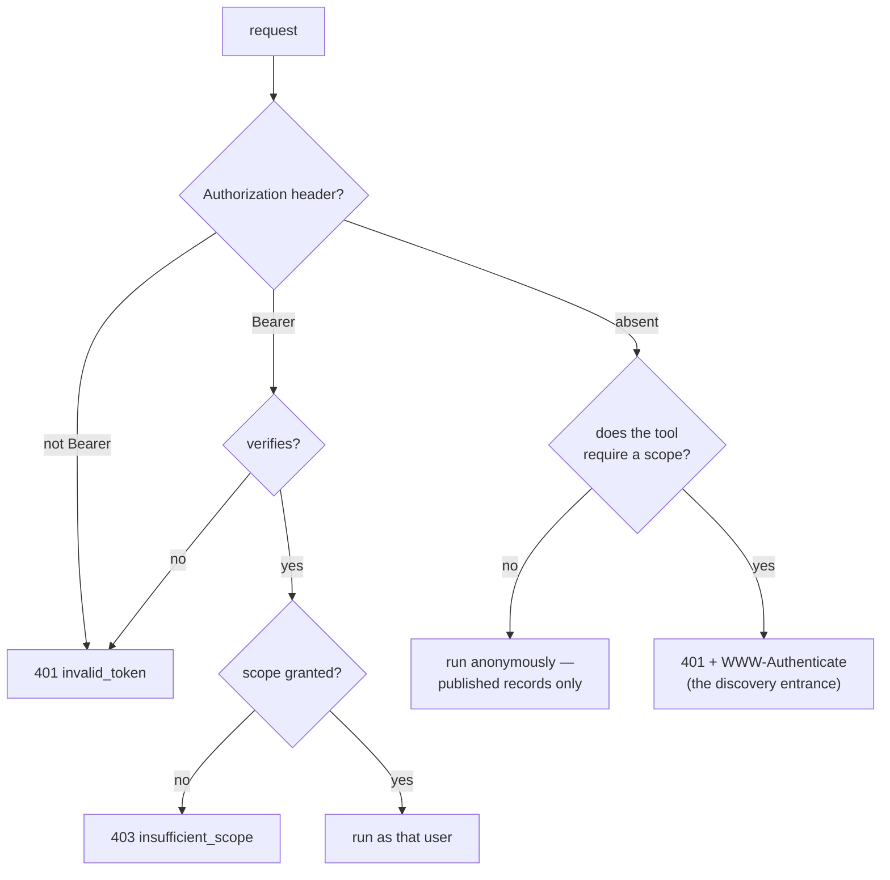
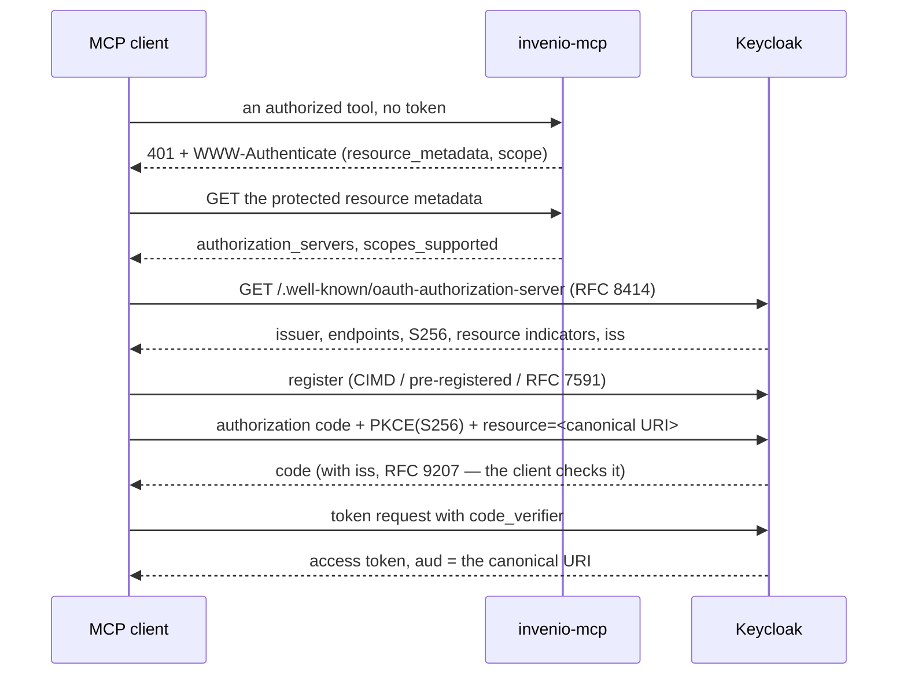

# Authentication

This page is about **who you are**. [Authorization](authorization.md) is about **what
you may do** once that is settled. The two are separate on purpose, and they are
separate in the code: a verifier turns a credential into an identity or into nothing,
and only then does a scope check run against that identity.

Keeping them apart is what makes the anonymous case expressible at all. "No identity"
is a legitimate outcome here — a repository publishes to everyone — rather than a
failure to be handled.

## Three ways an identity arrives

|  | stdio | HTTP, `invenio` mode | HTTP, `keycloak` mode |
| --- | --- | --- | --- |
| Credential | one InvenioRDM personal access token | an InvenioRDM personal access token, per request | an OAuth 2.1 access token, per request |
| Who verifies it | nobody — it is simply used | InvenioRDM, via `GET /api/me` | this server, via the realm's JWKS |
| Identities distinguishable | one | one per token | one per token |
| Anonymous callers | impossible — the token is always sent | yes | yes |
| Expiry | none | none | `exp` in the token (900 s by default) |
| Revocation | delete the token in InvenioRDM | the same, effective within the cache TTL | end the Keycloak session, or wait for `exp` |
| Federated login | no | no | yes, through the broker |

The rest of this page takes them in that order, then covers what is true of all three.

## How a credential is presented

`Authorization: Bearer <token>`, on every request. That is the only accepted form, and
the rules around it are deliberately unforgiving:

- **Another scheme is a hard 401.** `Authorization: Basic <token>` does not fall back to
  anonymous; it answers `401` with `error_description="Authorization scheme must be
  Bearer"`.
- **A token in the query string is not seen at all.** `?access_token=…` is never
  consulted — the specification forbids carrying access tokens there, so the request is
  simply an anonymous one, and any tool that needs a scope answers `401`.
- **A credential that is present but invalid never degrades to anonymous.** Expired,
  forged, wrong issuer, wrong audience: all `401`.

That last rule is the one worth dwelling on. Silently treating a bad token as "no
token" would let an expired session keep working in a degraded form — searches would
still return published records, and the user's own drafts would simply stop appearing.
The failure would present itself as *records having vanished*, not as *having been
logged out*. So the moment a credential is offered, it has to be good.



Everything to the right of "verifies?" is [authorization](authorization.md). Everything
to the left is this page.

## stdio: one token, one identity

The stdio server reads a token from `INVENIO_TOKEN`, or failing that from a `.token`
file beside `server.py`. `INVENIO_TOKEN` wins. There is no other source and no
per-caller identity: whoever can talk to that process **is** the owner of that token.

Two consequences that surprise people:

- **The token is not checked at startup.** The server does not call `/api/me` to see
  whether it works. A wrong or revoked token starts the server perfectly happily, and
  the first tool call fails with InvenioRDM's own error. That is a deliberate
  trade — a startup probe would make the server unusable while the repository is
  briefly down — but it means "the connector shows as running" says nothing about the
  credential.
- **An InvenioRDM personal access token does not expire.** Revoking it is the only way
  to end access (`invenio tokens delete -n mcp -u <email>`). Treat the `.token` file as
  a long-lived secret: it is worth the same as the account's password for everything the
  REST API can reach.

This is exactly why the HTTP server exists. See [The two servers](servers.md).

## PAT mode: InvenioRDM is the one that says yes

A personal access token is **opaque** — not a JWT, nothing to verify locally, no
signature and no claims. So the server asks the only party that can answer:

```
GET <INVENIO_API>/me
Authorization: Bearer <the token presented>
```

`200` means authenticated. Anything else means not. That is the whole of it, and it is
the same request you can run yourself with `curl` — see [Connecting to
InvenioRDM](../guides/invenio.md).

### What the answer is used for

`/me` does double duty. Besides settling identity, its `roles` are where scopes come
from, because a PAT carries none:

| Setting | Default | Meaning |
| --- | --- | --- |
| `MCP_INVENIO_BASE_SCOPES` | `mcp:read mcp:write` | granted to anyone who authenticates |
| `MCP_INVENIO_CURATE_ROLES` | `admin` | roles that additionally get `mcp:curate` |
| `MCP_INVENIO_VERIFY_TTL` | `60` | seconds to cache a **successful** `/me` |

Using stock InvenioRDM roles is the point: no extra vocabulary to define, no extension
to install, and the repository administrator changes MCP privileges the same way they
change everything else.

### The cache, and what is deliberately not cached

Verifying against a remote service on every request would put an InvenioRDM round trip
in front of every tool call. Successful results are therefore held for
`MCP_INVENIO_VERIFY_TTL` seconds, keyed by the token.

**Failures are never cached.** The asymmetry is on purpose: caching a success costs at
most `TTL` seconds of staleness after a revocation, while caching a failure would keep
rejecting a token that has just been fixed. A revoked token stops working within the
TTL; the default of 60 seconds is short enough that this is an operational answer.

!!! note "One round trip happens before the scope check"

    Scope checking is synchronous, but verifying a PAT is a network call. The middleware
    therefore verifies the `Authorization` header *first* and warms the cache, so the
    later synchronous lookup can succeed. If that warm-up fails — InvenioRDM unreachable,
    TLS not trusted from inside the container — the request is indistinguishable from a
    bad token and answers `401`. When `curl` from your laptop works but the server says
    `401`, this is usually where to look.

### The claims that do not exist

Downstream code — `whoami`, the audit log — wants claims. A PAT has none, so the server
synthesises a JWT-shaped view from `/me`: `sub` from the user id, `email`,
`preferred_username`, `aud` set to this server's canonical URI, `azp` of `invenio-pat`,
`scope` from the derived scopes, `iss` of the API base, and the raw `roles`. Nothing is
asserted here that `/me` did not say; the shape exists so that one code path serves both
modes.

`expires_at` is `None`, honestly: the token has no expiry to report.

### What the metadata advertises

There is no authorization server in this mode, so the protected resource metadata
**omits `authorization_servers`** and instead points a human at the token-issuing page
via `resource_documentation`:

```json
{
  "resource": "https://mcp.example.org/mcp",
  "scopes_supported": ["mcp:read"],
  "bearer_methods_supported": ["header"],
  "resource_documentation":
    "https://invenio.example.org/account/settings/applications/tokens/new/"
}
```

Advertising an authorization server that does not exist would send every conforming
client off to fetch `/.well-known/oauth-authorization-server` from InvenioRDM, which
returns `404`, and leave it stuck with no way forward. Saying nothing is the honest
answer, and it is why this mode is **not** MCP-authorization-conformant — a fact worth
stating plainly rather than papering over.

!!! warning "PAT mode has no audience separation"

    The token presented *is* an InvenioRDM token. It is not scoped to this server, and
    anyone holding it can use it directly against the repository, bypassing every tool
    boundary and the audit log with it. This is the price of not running an
    authorization server. Where it matters, run keycloak mode.

## keycloak mode: verified here, minted elsewhere

The token is a signed JWT from the realm. Verification is local — the realm's JWKS is
fetched and cached — and every one of these must hold:

| Check | Why it is there |
| --- | --- |
| RS256 signature against the realm's JWKS | the only defence against a well-formed token from somewhere else. A forged token can state a correct `iss` and `aud`; it cannot forge the signature |
| `iss` equals `KC_ISSUER` | a token from another authorization server is not ours, however valid it is |
| **`aud` equals this server's canonical URI** | stops a token minted for a different service being walked in |
| `exp`, with 10 s of leeway | clock skew, not a grace period |
| `exp`, `iat`, `iss`, `aud`, `sub` all **required to be present** | a missing claim is a failed check, never a skipped one |

There are two verifiers, not one, because there are two protected resources: `/mcp` and
[`/mcp-auth`](authorization.md#mcp-auth) have different canonical URIs and each
validates `aud` against its own. The realm setup puts both audiences on the token, so
one token works at either entrance.

### How the client gets a token in the first place



The `401` is the entrance, not an error. A client that has never been told anything
about this deployment can start from it and reach a usable token without configuration.

### Registering the client

The specification admits three routes, and the realm setup supports all of them:

| Route | Used by | Notes |
| --- | --- | --- |
| **Client ID Metadata Documents** | clients that publish a metadata URL | permitted domains are listed in `CIMD_DOMAINS` — the `redirect_uri` host is checked too, so loopback addresses belong in the list |
| **Pre-registered** | `conformance/curl-tour.sh` (`curl-tour`) | consent-free, so the whole flow completes in a shell. PKCE is still enforced |
| **Dynamic registration (RFC 7591)** | most MCP clients | anonymous registration is *closed by default in Keycloak*; the setup script removes the `trusted-hosts` policy for the PoC |

!!! warning "Anonymous dynamic registration is a PoC setting"

    Removing `trusted-hosts` lets anyone register a client at that realm. For anything
    beyond a proof of concept, list the trusted hosts instead, or move to CIMD.

One subtlety that cost real debugging time: Keycloak's *Allowed Client Scopes* policy
only permits the realm's **default** scopes at registration. `mcp:read` / `mcp:write` /
`mcp:curate` are optional scopes, so a client that names them in its registration
request is rejected with `insufficient_scope` unless they are explicitly allowed — and
`openid` has to be in that list too, because OIDC clients always send it, even though no
scope by that name exists in the realm.

### Realm settings that are about authentication

The setup script does not pick these numbers by taste. Each one is a response to
something that broke:

| Setting | Value | Why |
| --- | --- | --- |
| PKCE `S256` enforced by client policy | all clients | OAuth 2.1 requires PKCE, but Keycloak's default is only to *validate it if sent*. The policy rejects clients that omit it |
| `accessTokenLifespan` | 900 s | short-lived tokens, refreshed by the client |
| `ssoSessionIdleTimeout` | 8 h | at Keycloak's 30-minute default, re-authorization is frequent — and via Claude Desktop, the 60-second MCP timeout recreates the client process mid-flow, swapping the PKCE `code_verifier` and failing with `pkce_verification_failed` |
| `revokeRefreshToken` | on | refresh tokens rotate; reuse is rejected |
| `refreshTokenMaxReuse` | **1**, not 0 | zero tolerance kills the whole session when a client runs two instances against one `tokens.json` — one of them looks like a replay and everyone is logged out. One reuse absorbs that race; sustained reuse is still refused |
| `sslRequired` | `none` **in the PoC realm** | plaintext for local work. Set it to `external` or `all` anywhere real |

### After verification: the token is exchanged, not forwarded

The token you present is addressed to *this* server, so it is never sent onward to
InvenioRDM. It is exchanged (RFC 8693) for one with `aud=invenio-api` that still carries
your identity. That belongs to [Authorization](authorization.md#the-token-is-exchanged-never-forwarded);
what matters here is where its failures show up:

- Exchanged tokens are cached against the incoming token, and are only reused while at
  least 30 seconds of life remain.
- A failed exchange is **not** an authentication failure. You are authenticated; the
  server could not act for you. It surfaces as a tool error carrying Keycloak's status
  and response, not as a `401`.
- `MCP_SERVER_SECRET` has **no default**. Unset, the exchange raises rather than
  attempting a guessable value — the same reasoning as `KC_ADMIN_PASSWORD` in the setup
  script.

And on the InvenioRDM side, a Keycloak JWT is not something stock InvenioRDM accepts.
That layer is the one thing keycloak mode requires the repository to add; see
[Connecting to InvenioRDM](../guides/invenio.md#keycloak-mode).

## Federated identity

`keycloak/setup_gakunin_idp.py` adds a GakuNin SAML broker to the realm. It is optional,
and only meaningful in keycloak mode. What it demonstrates is less the SAML plumbing
than a blunt fact about federated login: **you get far less than you expect**.

| Wanted | What actually arrives |
| --- | --- |
| an email address | often nothing. `mail` is released at the institution's discretion |
| affiliation (`eduPersonScopedAffiliation`) | often nothing, for the same reason |
| a principal name | `eduPersonPrincipalName` (`eppn`) — reliably |
| group membership | `isMemberOf`, from GakuNin mAP |

So affiliation is not taken from an attribute at all. It is derived from the **Issuer of
the SAML assertion** — the institutional IdP's `entityID` — which is always present and
already signature-verified. Mapping `entityID` to an institution code is a registry the
repository side keeps; in the realm it takes the form of one hardcoded attribute per
registered IdP.

These reach the access token through a `federation` client scope, as `eppn`,
`is_member_of`, `idp_entity_id` and `tenant_id`, plus `idp` — the IdP actually used for
*this* session, taken from a session note rather than a stored attribute, so it is not
polluted by whichever login happened last. `whoami` reports them, and the audit log
carries `eppn` and `tenant_id`.

!!! note "mAP is mocked in the PoC"

    Properly, a broker looks group membership up through the mAP API keyed by `eppn`,
    which needs a Keycloak SPI in Java. The PoC carries `isMemberOf` in the mock IdP's
    SAML assertion instead. What it proves is that group claims reach the resource
    server — not how they were obtained.

### The missing email address

InvenioRDM requires an address, so when none is released, a placeholder is stored under
`PLACEHOLDER_EMAIL_DOMAIN` (`jwt.invalid` by default). `whoami` reports
`invenio.email_pending_setup: true` and hands back `profile_settings_url`.

This is worth surfacing to the user rather than hiding, because in that state **the
repository can send them no mail at all** — including review requests they are expected
to act on. An agent that notices it can say so.

## What the server never does

- **Never forwards the presented token to InvenioRDM** in keycloak mode. That is the
  confused-deputy problem the specification forbids.
- **Never logs a token.** The audit line carries `sub`, `azp`, `scope`, and the
  federation claims — never the credential. Set `MCP_AUDIT=off` to stop it entirely.
- **Never accepts a token outside the `Authorization` header.**
- **Never treats an invalid credential as an anonymous one.**
- **Never ships a default for a secret.** `MCP_SERVER_SECRET` and `KC_ADMIN_PASSWORD`
  stop the program when unset, rather than running on something guessable.

## When it does not work

| Symptom | Usually |
| --- | --- |
| Every call is `401` with a token that Keycloak just issued | `aud`. `MCP_RESOURCE` is not character-for-character the URL the client calls — a trailing slash, `localhost` against `127.0.0.1`, `http` against `https` |
| `401`, and the issuer looks right in the browser | `KC_ISSUER` differs between what the container sees and what the browser used. The issuer string must be identical everywhere |
| PAT mode `401`, but `curl /api/me` works from your machine | the *server* cannot reach or trust InvenioRDM. TLS trust inside the container, or hostname resolution |
| Works for a while, then stops | the 900-second access token expired and the client is not refreshing |
| `invalid_grant: Maximum allowed refresh token reuse exceeded` | two client instances sharing one token store |
| `pkce_verification_failed` | the client process was recreated mid-flow. `--auth-timeout 300` for `mcp-remote` |
| `mcp-remote` connects but never opens a browser | it only prepares for authorization on a failed first connection. Point it at [`/mcp-auth`](authorization.md#mcp-auth) |
| `Protected resource … does not match expected …` | the metadata's `resource` and the connected URI disagree — again the canonical URI |
| `token exchange failed: 400` | the `mcp-server` client secret does not match, or standard token exchange is not enabled on the realm (Keycloak 26.2+) |
| `403 insufficient_scope` | authentication succeeded. That is a [scope](authorization.md#step-up-403-not-401) problem, not this page |

More in [Troubleshooting](../guides/troubleshooting.md).

## Checking it

`http/conformance/mcp_client.py` runs the whole thing headless. The
authentication-specific assertions are:

- a garbage string as a token → `401`
- a well-formed JWT signed with **another key**, correct `iss` and `aud` → `401`
- a token from another issuer → `401`
- a real token with its signature replaced → `401`
- an expired token → `401` (the check really waits for a short-lived token to expire)
- `Authorization: Basic` → `401`
- `?access_token=…` on an authorized tool → `401`
- a token minted for InvenioRDM presented to the MCP server → `401`
- the protected resource metadata and the authorization server metadata are both
  reachable **without** a token — discovery cannot work otherwise

```bash
MCP_RESOURCE=https://<mcp>/mcp MCP_TEST_USER=... MCP_TEST_PASSWORD=... \
  python3 http/conformance/mcp_client.py
```

By hand, the two ends of the spectrum:

```bash
# anonymous: published records, no credential anywhere
curl -s -X POST https://<mcp>/mcp \
  -H 'Content-Type: application/json' \
  -H 'Accept: application/json, text/event-stream' \
  -d '{"jsonrpc":"2.0","id":1,"method":"tools/call",
       "params":{"name":"search_records","arguments":{"size":1}}}'

# authenticated: whoami shows the identity, the exchanged token and the InvenioRDM user
curl -s -X POST https://<mcp>/mcp \
  -H 'Content-Type: application/json' \
  -H 'Accept: application/json, text/event-stream' \
  -H "Authorization: Bearer $TOKEN" \
  -d '{"jsonrpc":"2.0","id":1,"method":"tools/call",
       "params":{"name":"whoami","arguments":{}}}'
```

`whoami` is the fastest way to answer "who does this server think I am" — it puts the
token bound to the MCP server, the token exchanged for InvenioRDM, and the InvenioRDM
user they resolved to side by side.
