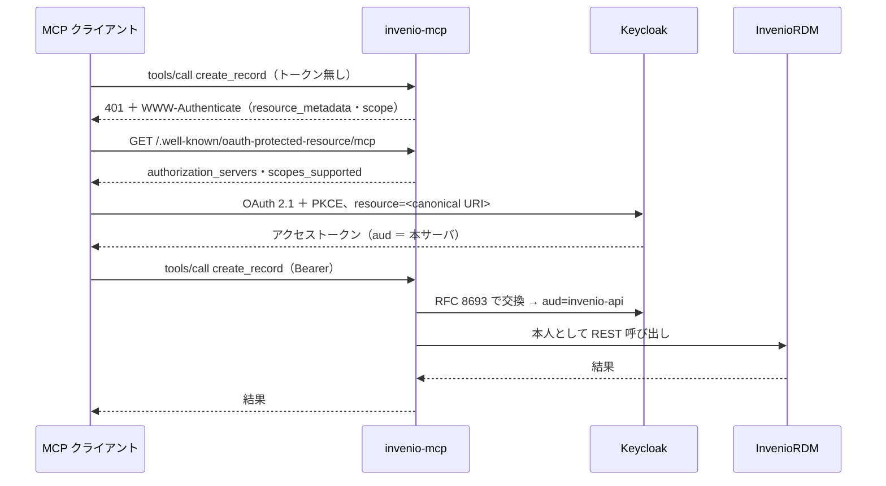

# 認可

この話が当てはまるのは HTTP 版だけである。stdio 版はトークンを1本持ち、どのツールも
それを使う（[2つのサーバ](servers.md)を参照）。

このページは[認証](authentication.md)が終わったところから始まる。呼び出し側の身元は
既に決まっていて、問うのは「それで何をしてよいか」である。

## 全体の形



## 3つの scope

| scope | 対象 | なぜ分けるか |
| --- | --- | --- |
| *（不要）* | 検索・取得・エクスポート・バージョン一覧・ファイル一覧・ダウンロード・語彙・コミュニティの参照 | リポジトリは誰にでも公開するものであり、REST API 自体がそうなっている |
| `mcp:read` | `whoami`・`my_records`・`list_revisions`・`list_requests`・`get_request` | 誰であるかによって答えが変わるもの |
| `mcp:write` | 作成・更新・公開・破棄・新バージョン・ファイル操作・コミュニティへの投稿・コメント | 変更するもの |
| `mcp:curate` | `delete_record`・`restore_record`・`request_action`・`create_community` | **InvenioRDM 側で admin 権限が要る**。下書きの破棄とは重さが違う |

**`mcp:curate` は権限の名ではなく、渡す力の名で付けてある。** `mcp:admin` では言い過ぎで、
実際に渡すのは公開レコードの取り下げと復元、査読の受理、コミュニティの作成であって、
管理者一般ではない。`delete` では言い足りない。復元は delete ではないし、`delete_draft` は
write 側にある。

取り下げと復元は**分けていない**。InvenioRDM 側でどちらも同じ admin 権限が要るので、
scope だけ割っても実際の権限分離にはならず、取り下げたものを戻せないクライアントが
生まれるだけになる。

## 読取を未認証で通すのは意図的である

未認証のクライアントでも公開レコードを検索・取得できる。これは抜けではない。

- リポジトリが既にそうしている。`GET /api/records` にトークンは要らない。
- トークンがあれば同じツールが**その人として**動くので、下書きも見える。
- 何も設定していない段階からリポジトリについて答えられる。人がモデルに最初に頼むのは、
  たいていそれである。

認可の要るツールをトークン無しで呼ぶと `401` が返り、`WWW-Authenticate` に
`resource_metadata` の URL と scope が載る。**これが発見フローの入口**であって、
回避すべきエラーではない。

## step-up は 401 ではなく 403

認証は通るが scope が足りないときは、MCP の認可仕様どおり `403 insufficient_scope` に
必要な scope を載せて返す。理解できるクライアントは、最初からやり直さずに広い scope へ
認可し直せる。

!!! warning "既製のクライアントはたいていこれを扱えない"

    MCP SDK は `401` でしか再認可せず、`403` を扱わない。[`/mcp-auth`](#mcp-auth) が
    最小集合ではなく `mcp:read mcp:write mcp:curate` を広告しているのはそのためで、
    そちらに来たクライアントは、扱えない 403 を踏む代わりに、必要なものを一度に得る。

## 同じ資源への入口が2つある {#mcp-auth}

`/mcp` は未認証のクライアントの接続を通す。`/mcp-auth` は `initialize` を含め、
最初の要求から `401` を返す。

後者が在るのは、実在するクライアントのふるまいのためである。*最初の*接続が失敗しないと
認可の準備をしない作りのものがある。`mcp-remote` 0.1.37 はコールバックの待ち受けを
`UnauthorizedError` の経路でしか作らないので、`/mcp` に対しては接続が成功してしまい、
あとからツール単位で `401` が返っても認可コードの受け取り先が無い。

`/mcp-auth` は同じ資源の別の扉ではなく、**独立した保護リソース**である。RFC 9728 は
メタデータの `resource` が接続先 URI と一致することを求め、クライアントはそこを検証する
——`mcp-remote` は *"Protected resource … does not match expected …"* と言って接続を
拒む。したがって専用の canonical URI と専用のメタデータを持たせ、Keycloak の realm 設定は
トークンに**両方の** audience を載せている。

## トークンは交換する。転送しない

keycloak モードで提示されるトークンは本サーバ宛である。それをそのまま InvenioRDM へ
送るのは仕様が禁じる confused deputy にあたるので、RFC 8693 で `aud=invenio-api` の
別トークンに交換して使う。交換後のトークンも**本人**の身元を持つので、InvenioRDM 自身の
権限判定はそのまま効く。

受け取り側では `aud` が本サーバの canonical URI であることを検証するので、他のサービス
向けに発行されたトークンを持ち込むことはできない。

PAT モードに交換は無い。受け取るトークンが**そもそも InvenioRDM のトークン**なので、
交換する先が無いからである。引き換えは明示してある——audience による分離が無い。
それが認可サーバを要らなくすることの代価であり、keycloak モードが在る理由でもある。

## 判定が実際に起きる場所

scope が決めるのは**クライアントが要求してよいか**である。**実際に行えるか**を決めるのは
InvenioRDM である。`mcp:curate` を持つ利用者でも、アカウントに admin ロールが無ければ
InvenioRDM から 403 が返る。それが正しい。権限の模型を2か所に持つことが、両者をずらす。

## 確かめ方

`http/conformance/mcp_client.py` が一連の流れを headless で走らせ、未認証呼び出しの 401、
`resource_metadata` からの発見、`resource` 付き PKCE(S256)（RFC 8707）、`iss` の検証
（RFC 9207）、403 からの step-up、別 audience 宛トークンの拒否を PASS/FAIL で報告する。

```bash
MCP_RESOURCE=https://<mcp>/mcp MCP_TEST_USER=... MCP_TEST_PASSWORD=... \
  python3 http/conformance/mcp_client.py
```
