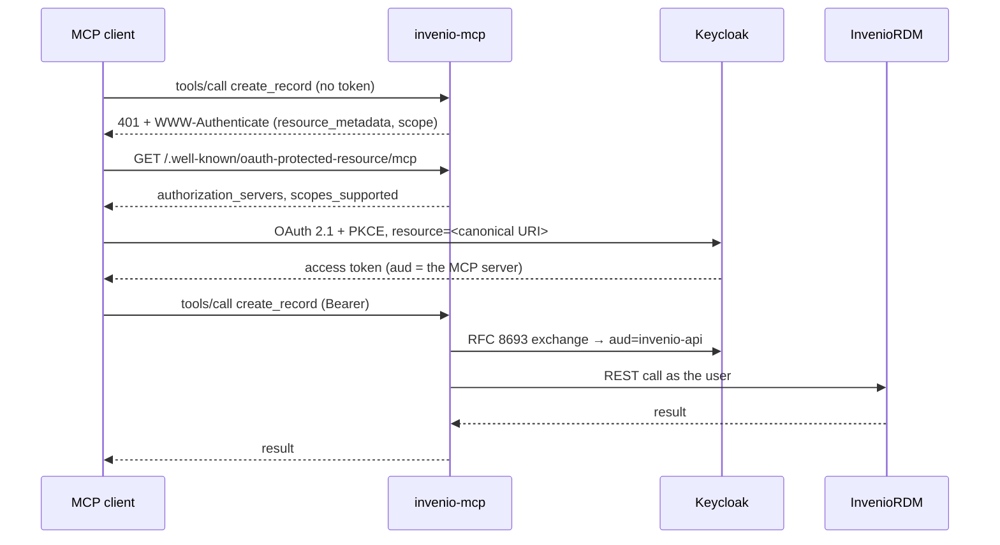

# Authorization

Only the HTTP server has any of this. The stdio server holds one token and every tool
can use it — see [The two servers](servers.md).

This page starts where [Authentication](authentication.md) leaves off: the caller's
identity is already settled, and the question is what they may do with it.

## The shape of it



## Three scopes

| Scope | What it covers | Why it is separate |
| --- | --- | --- |
| *(none)* | search, fetch, export, list versions, list files, download, vocabularies, read communities | A repository publishes to everyone, and the REST API behaves that way |
| `mcp:read` | `whoami`, `my_records`, `list_revisions`, `list_requests`, `get_request` | These answer differently depending on who you are |
| `mcp:write` | create, update, publish, discard, new version, file operations, submit to a community, comment | Changes |
| `mcp:curate` | `delete_record`, `restore_record`, `request_action`, `create_community` | Needs the **admin role in InvenioRDM**; a different weight from discarding a draft |

**`mcp:curate` is named after the capability, not the role.** Calling it `mcp:admin`
would overstate it — what it grants is withdrawing and restoring published records,
accepting reviews and creating communities, not administration in general. Calling it
`delete` would understate it, since restoring is not a delete and `delete_draft` is on
the write side.

Withdrawing and restoring are **not** split into two scopes. InvenioRDM requires the
same admin permission for both, so splitting them would not separate any real
privilege — it would only produce clients that can withdraw a record and not put it
back.

## Reading is unauthenticated on purpose

An unauthenticated client can search and fetch published records. This is not an
oversight:

- It is what the repository already does. `GET /api/records` needs no token.
- With a token, the same tools run **as that user**, so drafts appear too.
- It means a model can answer questions about the repository before anyone has set
  anything up, which is most of what people first ask it to do.

Calling an authorized tool without a token produces `401` with a `WWW-Authenticate`
that names both the `resource_metadata` URL and the scope. **That is the entrance to
the discovery flow**, not an error to be worked around.

## Step-up: 403, not 401

A token that authenticates but lacks the scope gets `403 insufficient_scope`, with the
scope named, per the MCP authorization specification. A client that understands it can
re-authorize for the larger scope without starting over.

!!! warning "Off-the-shelf clients often cannot do this"

    The MCP SDK re-authorizes on `401` and does not handle `403`. That is why
    [`/mcp-auth`](#mcp-auth) advertises `mcp:read mcp:write mcp:curate` rather than the
    minimal set — a client sent there gets everything it will need in one pass, instead
    of hitting a 403 it cannot act on.

## Two entrances to the same resource {#mcp-auth}

`/mcp` lets an unauthenticated client connect. `/mcp-auth` returns `401` from the very
first request, including `initialize`.

The second one exists because of a real client behaviour: some only prepare for
authorization if the *initial* connection fails. `mcp-remote` 0.1.37 builds its callback
listener only from the `UnauthorizedError` path, so against `/mcp` it connects
successfully, and a later per-tool `401` arrives with nowhere to receive the
authorization code.

`/mcp-auth` is a **separate protected resource**, not a second door onto the same one.
RFC 9728 requires the metadata's `resource` to match the URI the client connected to,
and clients check it — `mcp-remote` refuses with *"Protected resource … does not match
expected …"* otherwise. So it has its own canonical URI and its own metadata, and the
Keycloak realm setup puts **both** audiences on the token.

## The token is exchanged, never forwarded

In keycloak mode the token you present is addressed to this server. Sending it onward
to InvenioRDM would be the confused-deputy problem the specification forbids, so the
server exchanges it (RFC 8693) for a token with `aud=invenio-api` and uses that. The
exchanged token still carries **your** identity, which is why InvenioRDM's own
permission checks still apply.

`aud` is validated against this server's canonical URI on the way in, so a token minted
for some other service cannot be walked in.

In PAT mode there is no exchange: the token received **is** an InvenioRDM token, so
there is nothing to exchange it into. The trade-off is explicit — no audience
separation. That is the price of not needing an authorization server, and it is why
keycloak mode exists.

## Where the decision actually happens

The scopes decide **whether a client may ask**. InvenioRDM decides **whether it may
happen**. A user with `mcp:curate` whose account lacks the admin role still gets a 403
from InvenioRDM, and that is correct: holding the permission model in two places is how
the two get out of step.

## Checking it

`http/conformance/mcp_client.py` runs the whole flow headless and reports PASS/FAIL for
the 401 on an unauthenticated call, discovery from `resource_metadata`, PKCE (S256)
with `resource` (RFC 8707), `iss` validation (RFC 9207), 403-then-step-up, and rejection
of a token issued for a different audience.

```bash
MCP_RESOURCE=https://<mcp>/mcp MCP_TEST_USER=... MCP_TEST_PASSWORD=... \
  python3 http/conformance/mcp_client.py
```
