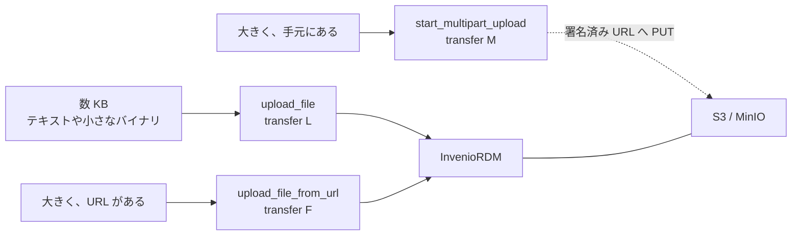

# ファイルの運び方

MCP の引数も結果も JSON である。バイト列はそうではないので、README と 4GB の
データセットの両方に効く運び方は1つもない。HTTP 版は経路を3つ用意していて、
どれを選ぶかがこの話のほとんどを占める。



## `upload_file` — 引数に中身を載せる

中身は `content_base64` か `content_text` として JSON-RPC の呼び出しに入るので、
クライアント・本サーバ・InvenioRDM を順に通って届く。素直だが、上限がある——既定 16MB
（`MCP_MAX_UPLOAD_BYTES`）。

InvenioRDM の transfer 種別 `L`（LOCAL）にあたり、`mcp:write` 以外に要るものは無い。
モデルが生成しうるもの——README、メタデータの副ファイル、小さな CSV——はこれでよい。

## `upload_file_from_url` — URI を渡す

URL を登録し、**InvenioRDM の Celery ワーカー**に非同期でダウンロードさせる
（transfer 種別 `F`、FETCH）。バイト列が MCP のプロトコルを通らないので、
サイズの上限が無い。

!!! warning "InvenioRDM v14 では通常の利用者は使えない"

    既定の権限方針（`RDMRecordPermissionPolicy.can_draft_create_files`）は
    transfer 種別 `L` と `M` にしか一般利用者を通さない。`F` と `R` は
    `SystemProcess()`——システム処理と superuser——に限られている。サーバに任意の URL を
    取りに行かせる操作は SSRF になりうるからである。権限が無ければ 403 になり、
    ツールはそう伝えて multipart を案内する。

取得先は InvenioRDM 側の `RECORDS_RESOURCES_FILES_ALLOWED_DOMAINS` にも含まれている
必要がある。含まれていない URL は `Domain not allowed` になる。

非同期なので、戻った時点でまだ取得中（`status` が `pending`）のことがある。
`list_files` の `status` が `completed` になったかで確かめる。

## `start_multipart_upload` — 署名済み URL

**手元にある大きなファイル**のための経路。サーバが InvenioRDM に multipart アップロード
（transfer 種別 `M`）を申請し、パートごとの署名済み URL を返す。クライアントはそこへ
**S3(MinIO) へ直接** PUT する——バイト列は本サーバも InvenioRDM も通らず、サイズの上限は
事実上無い。

```bash
split -b 67108864 ./big.bin part_
curl -X PUT --data-binary @part_aa "<parts_urls[0].url>"
curl -X PUT --data-binary @part_ab "<parts_urls[1].url>"
# 全部送ったら
complete_multipart_upload(recid, filename)
```

S3 の決まりは、サーバ側で織り込んである。

- 最後以外のパートは **5MiB 以上**で、すべて同じ大きさでなければならない
- パート数は **10000 まで**——収まるまで `part_size` を倍にする
- `size` はファイルの**実バイト数**。事前に申告する

確定直後の `checksum` は `multipart:<ETag>-<パート数>-<パートの大きさ>` の形になる。
これは S3 の複合 ETag であってファイルの MD5 ではない。本当の MD5 は InvenioRDM が
背後の非同期ジョブで計算し直す。

途中でやめたときは `abort_multipart_upload`。S3 側の未完了アップロードも中止されるので、
送りかけのパートが課金対象として残り続けない。

## ダウンロード

`download_file` が在るのは、配備の都合による。S3 保存では、InvenioRDM は内容の要求に
**クラスタ内部名（`minio:9000`）をホストに持つ署名済み URL** で応じる——クラスタの外からは
辿れない。そこでサーバが代わりに取りに行き、中身を base64 で返す。UTF-8 として読めれば
`text` にも入れる。署名済み URL には **Authorization を付けずに**取りに行く。署名だけで
認可されているし、InvenioRDM のトークンをオブジェクトストアに渡す理由が無い。

同じ 16MB の上限がかかる。理由も同じで、応答が JSON だからである。

## 公開済みレコードにファイルは足せない

これは InvenioRDM の決まりであって、こちらの都合ではない。公開済みのものにファイルを
足す・差し替えるには、新しいバージョンを作る。

```python
new_version(recid, import_files=True)   # 前バージョンのファイルを引き継ぐ
upload_file(new_id, "extra.csv", content_text="...")
publish_record(new_id)
```

`new_version` は `publication_date` が無ければ埋める。**InvenioRDM が新バージョンの
下書きに公開日を引き継がない**ためで、これが無いと publish が
`metadata.publication_date: Missing data for required field` で失敗する。

## 3経路を確かめる

`http/conformance/verify-mcp-files.py` が LOCAL・FETCH・MULTIPART の3経路と
`download_file` に実データを往復させ、複合 ETag と MD5 を手元の計算値と突き合わせる
（16点）。

```bash
MCP_RESOURCE=https://<mcp>/mcp INVENIO_UI=https://<invenio> \
  python3 http/conformance/verify-mcp-files.py
```
