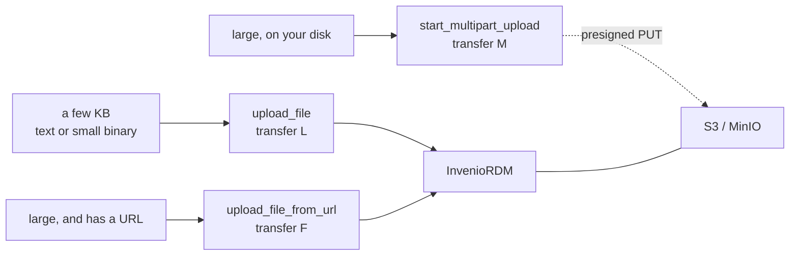

# Files and transfers

MCP arguments and results are JSON. Bytes are not, so there is no single way to move a
file that works for both a README and a 4GB dataset. The HTTP server offers three
paths, and picking the right one is most of what there is to know.



## `upload_file` — bytes in the arguments

The content travels as `content_base64` or `content_text` inside the JSON-RPC call, so
it passes through the client, this server and InvenioRDM before it lands. Simple, and
bounded: the default limit is 16MB (`MCP_MAX_UPLOAD_BYTES`).

This is InvenioRDM transfer type `L` (LOCAL) and it needs nothing beyond `mcp:write`.
Use it for anything a model would plausibly generate — a README, a metadata sidecar, a
small CSV.

## `upload_file_from_url` — hand over a URI

Registers the URL and lets **InvenioRDM's Celery worker** download it asynchronously
(transfer type `F`, FETCH). No size limit, because the bytes never touch the MCP
protocol.

!!! warning "Ordinary users cannot use this on InvenioRDM v14"

    The default policy (`RDMRecordPermissionPolicy.can_draft_create_files`) admits
    ordinary users for transfer types `L` and `M` only. `F` and `R` are restricted to
    `SystemProcess()` — system processes and superusers. Making a server fetch an
    arbitrary URL is SSRF-shaped, which is why. Without the permission you get a 403,
    and the tool says so and points at multipart instead.

The target must also be inside `RECORDS_RESOURCES_FILES_ALLOWED_DOMAINS` on the
InvenioRDM side, or the fetch fails with `Domain not allowed`.

Because it is asynchronous, the tool can return while the download is still running
(`status` is `pending`). Confirm with `list_files` until `status` is `completed`.

## `start_multipart_upload` — presigned URLs

For **a large file already on your disk**. The server asks InvenioRDM for a multipart
upload (transfer type `M`) and returns presigned URLs, one per part. The client then
PUTs the parts **straight to S3/MinIO** — the bytes pass through neither this server nor
InvenioRDM, and there is effectively no size limit.

```bash
split -b 67108864 ./big.bin part_
curl -X PUT --data-binary @part_aa "<parts_urls[0].url>"
curl -X PUT --data-binary @part_ab "<parts_urls[1].url>"
# then
complete_multipart_upload(recid, filename)
```

S3's rules, which the server plans around for you:

- every part but the last must be **at least 5MiB**, and they must all be the same size
- at most **10000 parts** — `part_size` is doubled until the count fits
- `size` is the file's **exact byte count**, declared up front

Right after completion the `checksum` reads
`multipart:<ETag>-<parts>-<part_size>`. That is S3's composite ETag, not an MD5 of the
file; InvenioRDM recomputes the real one in a background job.

`abort_multipart_upload` cancels an upload that was given up partway, which also aborts
it on the S3 side so half-sent parts stop costing storage.

## Downloading

`download_file` exists because of a deployment detail. With S3 storage, InvenioRDM
answers a content request with a **presigned URL whose host is an in-cluster name**
(`minio:9000`) — unreachable from outside the cluster. So the server follows it itself
and returns the bytes as base64, plus `text` when they decode as UTF-8. The presigned
URL is fetched **without** the Authorization header, since it is authorized by its
signature and the InvenioRDM token has no business going to the object store.

The same 16MB ceiling applies, for the same reason: the response is JSON.

## Published records cannot take new files

This is InvenioRDM's rule, not ours. To add or replace a file on something already
published, make a new version:

```python
new_version(recid, import_files=True)   # carries the previous files over
upload_file(new_id, "extra.csv", content_text="...")
publish_record(new_id)
```

`new_version` fills in `publication_date` when it is missing, because **InvenioRDM does
not carry it into the new draft** and publishing without it fails with
`metadata.publication_date: Missing data for required field`.

## Checking all three

`http/conformance/verify-mcp-files.py` round-trips real data through LOCAL, FETCH and
MULTIPART plus `download_file`, and checks the composite ETag and MD5 against locally
computed values — 16 assertions.

```bash
MCP_RESOURCE=https://<mcp>/mcp INVENIO_UI=https://<invenio> \
  python3 http/conformance/verify-mcp-files.py
```
