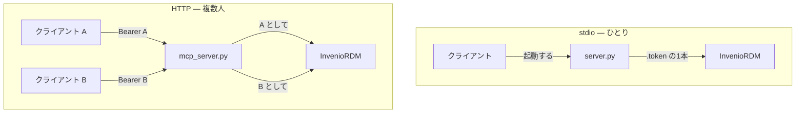

# 2つのサーバ

同じ仕事を、状況の違う2つの場面それぞれに合わせて実装してある。互いの新旧版ではない。
どちらも非推奨ではなく、どちらも実インスタンスに対して疎通を確認している。

## なぜ2つあるのか

stdio 版は、利用者がちょうど1人のときに MCP サーバが取る形そのものである。
クライアントが子プロセスとして起動し、自分の隣にあるファイルからトークンを1本読み、
そのトークンにできることは、どのツールにもできる。試すときと、ひとりで使うときには
これが正しい。1度で読み切れる大きさであることも、見た目より効く——自分のリポジトリに
向ける前に、何をされるのかを確かめられる。

利用者が2人目になった瞬間、この形は成り立たなくなる。トークンを1本しか持たない
プロセスを2人で共有することはできない。そこで HTTP 版は**リソースサーバ**として、
リクエストごとにトークンを受け取り、それが誰かを確かめ、残りの判断は InvenioRDM に
委ねる。

## HTTP 版が足しているもの

| | stdio | HTTP |
| --- | --- | --- |
| ツール数 | 12 | 33 |
| 語彙 | — | `list_vocabulary_types`・`list_vocabulary` |
| エクスポート形式 | — | DataCite・MARCXML・BibTeX など12種 |
| コミュニティと査読 | — | 検索・作成・投稿・受理・コメント |
| バージョンと版履歴 | `new_version` のみ | `list_versions`・`list_revisions` |
| 大容量ファイル | REST のみ | [署名済み URL の multipart](files.md) |
| トークン無しの読取 | 不可（常に送る） | 公開レコードなら可 |
| 権限分離 | なし | [3つの scope](authorization.md) |
| 監査ログ | — | 1呼び出し1行の JSON |

増えたツールは思いつきで並べたものではない。どれも、無いとエージェントが行き詰まった
から在る。

- **語彙。** メタデータを書くエージェントは `resource_type.id`・`license.id`・
  `relation_type.id` を出さなければならない。当てずっぽうは 400 を生み、それは
  検証エラーの雑音にしか見えない。先に id を引けるだけで、再試行の輪が1回の呼び出しに
  変わる。
- **コミュニティとリクエスト。** マルチテナントのリポジトリではコミュニティが組織単位
  そのもので、投稿してから査読を受けるのが実際の運用である。これが無いと、モデルは
  レコードを作れてもどこにも受理させられない。
- **`whoami`。** 「書きかけは何があるか」という問いの答えは、トークンが誰だと言っているか
  に依る。学認のような連合認証ではさらに、メールアドレスがそもそも降りてきたかにも依る。
  そこは覗けたほうがよい。

## どちらにも共通していること

どちらも **REST API のクライアントでしかない**。データベースを持たず、レコードを
キャッシュせず、権限を判定しない。

- 破壊的操作（`delete_record`）は `confirm=True` を要求し、ソフト削除で、
  `restore_record` で戻せる。
- ハード削除は提供しない。REST API に無いからである。
- 最終的な権限判定は InvenioRDM のもの。そこで通らなければツールもそこで失敗し、
  エラーはそのまま返る。
- 利用者に見える文字列は、どちらも [`locales/`](../reference/languages.md) から読む。

## どちらを動かすか

**理由が無ければ `http/`。** PAT モードなら認可サーバが要らないので、stdio に対する
運用の増分はコンテナ1つである。その代わりに残り 21 本のツールと、ツール単位の scope と、
監査の記録が付いてくる。

`stdio/` を選ぶのは、動かす前に実装を全部読んでおきたいとき、利用者が自分ひとりのとき、
待ち受けポートを増やすほどではないときである。
