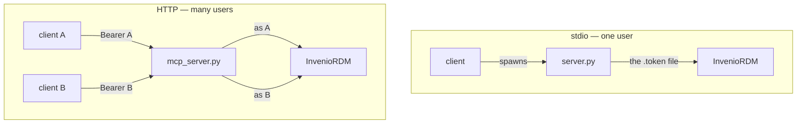

# The two servers

The same job done twice, for two different situations. They are not versions of each
other — neither is deprecated, and both are exercised against a live InvenioRDM.

## Why there are two

The stdio server is what an MCP server looks like when there is exactly one user: the
client launches it as a child process, it reads one token from a file next to itself,
and everything that token can do, any tool can do. That is the right shape for trying
the thing out and for working alone. It is also small enough to read in one sitting,
which matters more than it sounds — you can check what it will do to your repository
before you point it at one.

The moment there is a second user, that shape stops working. Two people cannot share a
process that holds one token. So the HTTP server is a **resource server**: it takes a
token per request, works out who that is, and lets InvenioRDM decide the rest.

## What the HTTP version adds

| | stdio | HTTP |
| --- | --- | --- |
| Tools | 12 | 33 |
| Vocabularies | — | `list_vocabulary_types`, `list_vocabulary` |
| Export formats | — | 12, including DataCite, MARCXML, BibTeX |
| Communities and review | — | search, create, submit, accept, comment |
| Versions and revisions | `new_version` only | `list_versions`, `list_revisions` |
| Large files | REST only | [presigned multipart](files.md) |
| Reading without a token | no — the token is always sent | yes, for published records |
| Privilege separation | none | [three scopes](authorization.md) |
| Audit log | — | one JSON line per call |

The extra tools are not arbitrary. Each one exists because an agent kept failing
without it:

- **Vocabularies.** An agent writing metadata has to produce `resource_type.id`,
  `license.id`, `relation_type.id`. Guessing produces 400s that read like validation
  noise. Being able to list the ids first turns a retry loop into one call.
- **Communities and requests.** In a multi-tenant repository the community *is* the
  organisational unit, and submission-then-review is the actual workflow. Without those
  tools the model can create records but cannot get them accepted anywhere.
- **`whoami`.** When a user asks "what have I got in progress", the answer depends on
  who the token says they are, and — with federated login — on whether an email address
  ever arrived. That is worth being able to inspect.

## What they share

Both are **REST API clients and nothing more**. Neither holds a database, neither caches
records, and neither decides permissions:

- The destructive operation (`delete_record`) needs `confirm=True`, is a soft delete,
  and can be reversed with `restore_record`.
- A hard purge is not offered, because the REST API does not expose one.
- The final permission decision is InvenioRDM's. If the token cannot do it there, the
  tool fails there, and the error comes back as it was.
- User-facing text comes from [`locales/`](../reference/languages.md) in both.

## Which one to run

**Use `http/` unless you have a reason not to.** In PAT mode it needs no authorization
server, so the operational cost over stdio is one container. In exchange you get the
other 21 tools, per-tool scopes and an audit trail.

Use `stdio/` when you want to read the entire implementation before running it, when
you are the only user, or when adding a listening port is not worth it.
