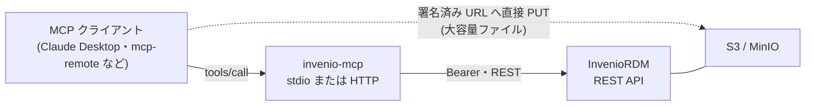

# invenio-mcp

**[InvenioRDM](https://inveniordm.docs.cern.ch/) を言語モデルから操作する MCP サーバ。**
レコードの検索・登録・更新・公開、ファイルの添付、コミュニティへの投稿と査読、公開
レコードの取り下げと復元まで、クライアントから呼べるツールとして出す。

InvenioRDM とは **REST API だけ**でやりとりする。移行するデータベースも、揃えておく
必要のあるスキーマも無い。`GET /api/records` が返るインスタンスなら、そのまま動く。
リポジトリ側に入れるものも無い——例外は [keycloak モード](guides/invenio.md#keycloak)で、
そこだけは InvenioRDM が交換後の JWT を受け付けられる必要がある。

対象は **InvenioRDM v14**。

## 2系統の実装

|  | [`stdio/`](guides/stdio.md) | [`http/`](guides/http.md) |
| --- | --- | --- |
| 転送 | stdio（クライアントの子プロセス） | Streamable HTTP |
| ツール数 | 12 | 33 |
| 認証 | 個人アクセストークン1本 | OAuth 2.1 ／ 個人アクセストークン |
| 権限分離 | なし——トークンの権限がすべて | [ツール単位の scope](concepts/authorization.md) |
| 大容量ファイル | REST 経由のみ | [署名 URL で S3/MinIO へ直送](concepts/files.md) |
| 依存 | stdlib ＋ `mcp` | ＋ `httpx` / `PyJWT` / `uvicorn` |
| 想定 | 手元での試用・開発 | 複数利用者・運用 |

**迷ったら `http/`。** `stdio/` は依存が軽く1ファイルで読み切れるので、まず動かして
中身を把握したいときや、自分ひとりで使うときに向く。

## できること

- **公開レコードの読取にトークンは要らない。** リポジトリは公開レコードを誰にでも
  見せるものだし、REST API 自体がそうなっている。検索・取得・エクスポート・ファイル
  一覧は未認証で通す。認可が要るのは「本人でないとできないこと」だけ。
- **書く前に語彙を引ける。** `list_vocabulary("resourcetypes")` が無いと、エージェントは
  `resource_type.id` を当てずっぽうで書いて 400 を集めることになる。
- **破壊的操作は必ず確認を挟む。** 公開レコードの取り下げは `confirm=True` を要求し、
  ソフト削除なので tombstone が残り、`restore_record` で戻せる。
- **日本語と英語を言語リソースとして同梱。** ツールの説明もエラーも `locales/` から
  読み、`MCP_LANG` で選ぶ。[言語](reference/languages.md)を参照。

## あえてしないこと

- **権限を判定しない。** 最終的な答えは常に InvenioRDM が出す。MCP 側の scope は
  *クライアントがそもそも何を要求できるか* を分けるだけで、それ以上のことはしない。
  権限の仕組みを二重に持てば、ずれる場所が1つ増える。
- **ハード削除をしない。** InvenioRDM の REST API に purge が無いので、こちらにも無い。
  取り下げは必ず戻せる。
- **トークンを転送しない。** keycloak モードで提示されるトークンは本サーバ宛であり、
  RFC 8693 で InvenioRDM 宛の別トークンに**交換**する。中継はしない。
  [認可](concepts/authorization.md)を参照。
- **InvenioRDM に何も入れない**——ただし keycloak モードだけは、インスタンスが
  Keycloak 発行の JWT を受け付ける必要がある。素の InvenioRDM はそれをしない。
  [何が要るか](guides/invenio.md#keycloak)。

## 次に読むもの

- [クイックスタート](quickstart.md) — 動かして1回ツールを呼ぶまで
- [InvenioRDM と繋ぐ](guides/invenio.md) — リポジトリ側に要るもの
- [2つのサーバ](concepts/servers.md) — どちらを使うか、なぜ違うのか
- [ツール一覧](reference/tools.md) — 33 ツール（実装から生成している）
- [設定](reference/configuration.md) — 環境変数の全一覧
