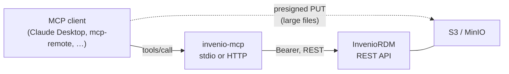

# invenio-mcp

**MCP servers for operating [InvenioRDM](https://inveniordm.docs.cern.ch/) from a
language model.** Search, create, update and publish records; attach files; submit to
communities and run the review workflow; withdraw and restore published records — all
exposed as tools a client can call.

They talk to InvenioRDM over **nothing but its REST API**. There is no database to
migrate and no schema to keep in step; if your instance answers `GET /api/records`,
these servers work against it. Nothing has to be installed on the repository side
either — with one exception, [keycloak mode](guides/invenio.md#keycloak-mode), where
InvenioRDM has to be able to accept the exchanged JWT.

Targets **InvenioRDM v14**.

## Two implementations

|  | [`stdio/`](guides/stdio.md) | [`http/`](guides/http.md) |
| --- | --- | --- |
| Transport | stdio (a child process of the client) | Streamable HTTP |
| Tools | 12 | 33 |
| Authentication | one personal access token | OAuth 2.1 **or** a personal access token |
| Privilege separation | none — whatever the token can do | [per-tool scopes](concepts/authorization.md) |
| Large files | through the REST API only | [presigned URLs straight to S3/MinIO](concepts/files.md) |
| Dependencies | standard library + `mcp` | + `httpx` / `PyJWT` / `uvicorn` |
| Intended for | trying it out, local development | multiple users, real operation |

**Start with `http/` unless you have a reason not to.** `stdio/` is a single file with
almost no dependencies, which makes it a good way to read the whole thing and to run it
for yourself alone.

## What it does

- **Reading published records needs no token.** A repository shows published records to
  everyone and the REST API behaves that way, so searching, fetching, exporting and
  listing files are unauthenticated. Authorization is required only for the things that
  need to be *you*.
- **The model can look up vocabularies before it writes.** Without
  `list_vocabulary("resourcetypes")` an agent guesses at `resource_type.id` and collects
  400s.
- **The destructive operation asks first.** Withdrawing a published record takes
  `confirm=True`, is a soft delete, and leaves a tombstone that `restore_record` lifts.
- **English and Japanese ship as language resources.** Tool descriptions and error
  messages come from `locales/`, selected with `MCP_LANG`. See
  [Languages](reference/languages.md).

## What it deliberately does not do

- **It does not decide permissions.** The final answer is always InvenioRDM's. The MCP
  scopes separate *what a client may ask for*, and nothing more — a second permission
  system would be one more thing to get out of step.
- **It does not hard-delete.** InvenioRDM's REST API exposes no purge, so neither can
  this. A withdrawal can always be undone.
- **It does not forward your token.** In keycloak mode the token you present is
  addressed to this server; it is exchanged (RFC 8693) for one addressed to InvenioRDM,
  never relayed. See [Authorization](concepts/authorization.md).
- **It does not install anything into InvenioRDM** — except that keycloak mode needs
  the instance to accept a Keycloak-issued JWT, which stock InvenioRDM does not do.
  [What that requires](guides/invenio.md#keycloak-mode).

## Where to go next

- [Quickstart](quickstart.md) — a running server and a first tool call
- [Connecting to InvenioRDM](guides/invenio.md) — what the repository side needs
- [The two servers](concepts/servers.md) — which one, and why they differ
- [Tool reference](reference/tools.md) — all 33 tools, generated from the code
- [Configuration](reference/configuration.md) — every environment variable
